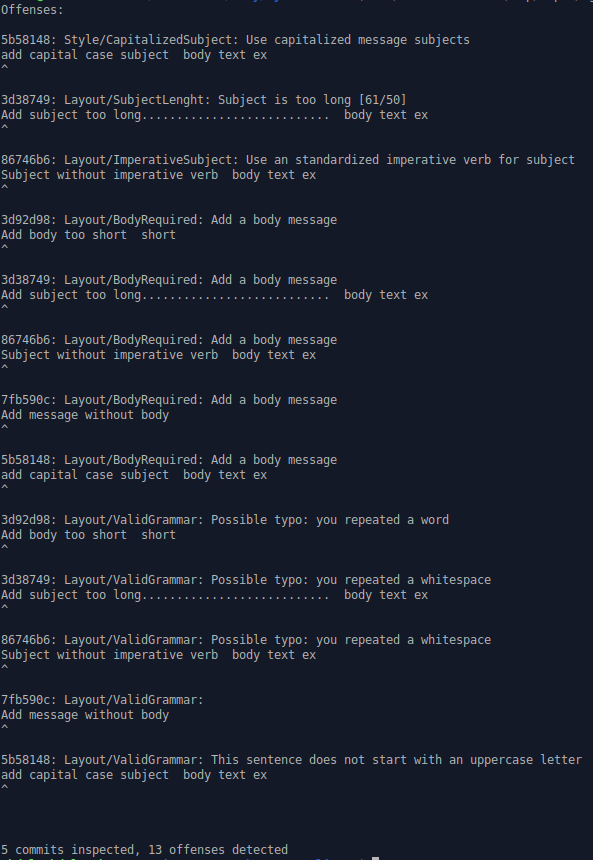

# Git Messages Linter

> This project consists of building a linter to follow the best practices for commit messages.

## Built With

- ruby 2.6.5p114 (2019-10-01 revision 67812) [x86_64-linux]

## Installation

### Requirements

- ruby ^2.6.x
- git ^2.x

### Steps

From the command line:

    $ git clone https://github.com/abdelp/my-own-linter.git

### Install dependecies

Go to the root folder of the project and execute:

    $ cd my-own-linter/
    $ bundler

### Execution

You have to select a branch and the git directory to run the linter:

    $ bin/main.rb master your_dir/.git

### Example

You can run the file scripts/create_repos.sh in order to create local repos to test the linter

    $ chmod 755 scripts/create_repos.sh

    $ scripts/create_repos.sh
    
Then in the root folder of the project, execute the linter:

    $ bin/main.rb master /tmp/repo2/.git
    
Should be displayed the next output:

## Author

👤 **Abdel Pérez**

- Github: [@abdelp](https://github.com/abdelp/)

- Twitter: [@AbdelPerez11](https://twitter.com/abdelperez11)

- Linkedin: [Abdel Pérez](https://www.linkedin.com/in/abdel-p%C3%A9rez-t%C3%A9llez-72b2aa153/)

## 🤝 Contributing

Contributions, issues and feature requests are welcome!

Feel free to check the [issues page](https://github.com/abdelp/my-own-linter/issues).

## Show your support

Give a ⭐️ if you like this project!

## 📝 License

This project is [MIT](lic.url) licensed.